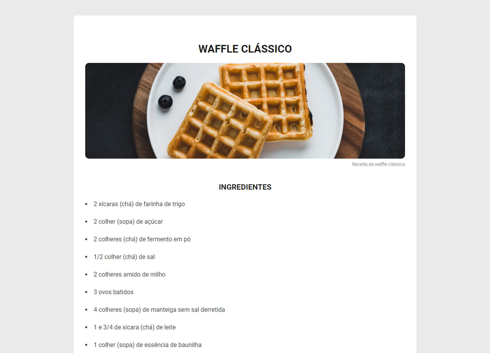

<h1 align="center"> Site de receita </h1>

O projeto consiste em uma página web contendo uma receita, com imagem, e informações sobre modo de preparo e ingredientes necessários.

<<<<<<< HEAD

  

=======
>>>>>>> 67db64fa7492367e91716f9ae32e3d9903e70097
## 🚀 Tecnologias

Esse projeto foi desenvolvido com as seguintes tecnologias:

- HTML
- CSS

## 💻 Projeto

- [Acesse o projeto finalizado, online](https://matheusbalbe.github.io/Site-de-receita)

---

Feito por [Matheus Balbe](https://www.linkedin.com/in/matheusbalbe)
